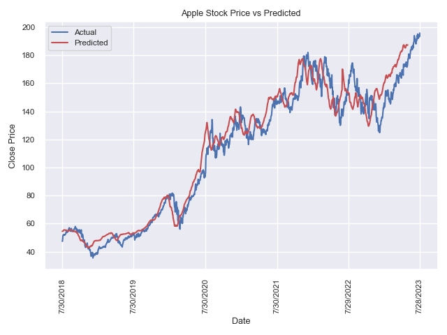

# Apple Stock Price Prediction RNN Model
## Skills Used: Python, Machine Learning, Recurrent Neural Network, Pandas, Numpy, Seaborn
### Data From: Yahoo Finance, 5Y as of 7/29/23
Personal Project of mine as I wanted to learn more about machine learning techniques in finance.  Google lead me to the concept of an RNN and I decided to try it myself.  Added a quick lineplot via Seaborn to visualize the actual price vs for model predictions.
Overall happy with how it came out.  I am glad I have some experience with machine learning especially in the finance industry.  Would love to spend more time improving this model and getting to understand the complexity of RNNs.  Here is the visual I made with seaborn and matplotlib depicting the actual vs predicted values:

## Possibilities for Improvement:
- Adjust Dropout levels to try and look for over/undertuning
- Add more variables to the model (e.g. open price, (adjusted) volume, etc.)
- Create many to one model instead of one to one model using other variables such as open, change, and (adjusted) volume
